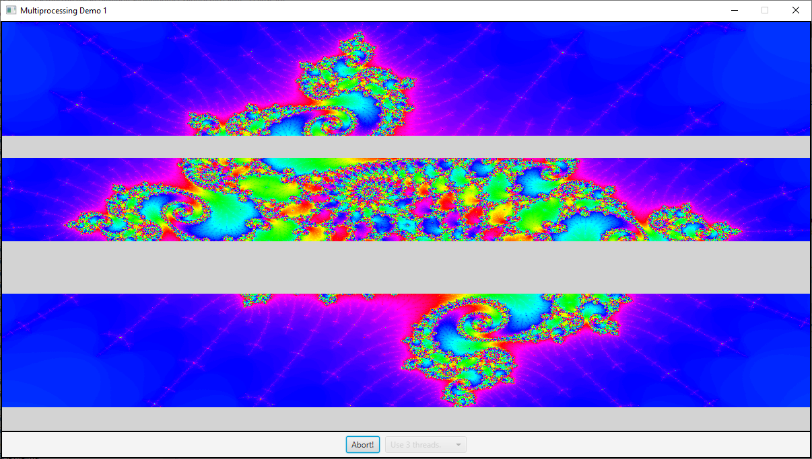
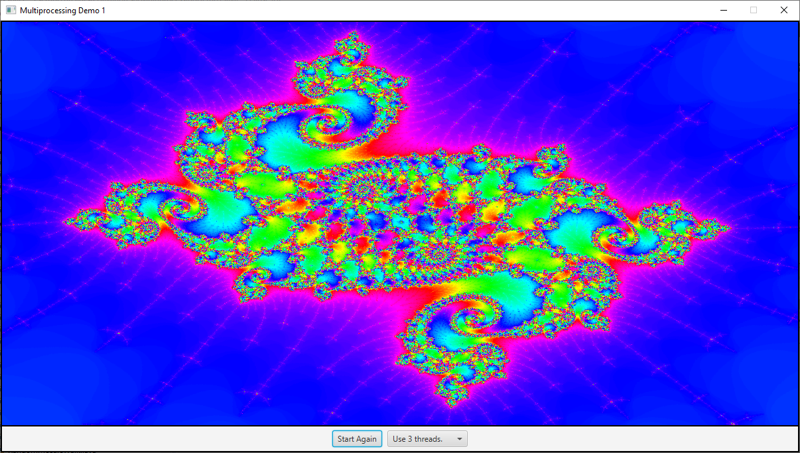

# ESEMPI THREAD

## ESEMPIO SIMPLE THREAD

Esempio di utilizzo delle primitive dei thread: `join()`, `sleep()`, `isAlive()`, `interrupt()`: [io.checksound.concurrency.SimpleThreads](./src/io/checksound/concurrency/SimpleThreads.java).

## ESEMPIO CALCOLO DEI NUMERI PRIMI

Per sapere il numero di processori su PC:

```java

Runtime.getRuntime().availableProcessors();

```

Codice esempio calcolo numeri primi:

Vesrsione 1 - creazione di thead: [javanotes8.ThreadTest1](./src/javanotes8/ThreadTest1.java)

Versione 2 - coordinamento tramite **join** e utilizzo di **synchronized**: [javanotes8.ThreadTest2](./src/javanotes8/ThreadTest2.java)

Versione 3 - utilizzo di variabili atomiche: [javanotes8.ThreadTest3](./src/javanotes8/ThreadTest3.java)

Versione 4 - utilizza `Callable`, `Future` ed `ExecutorService`: [javanotes8.ThreadTest4](./src/javanotes8/ThreadTest4.java). 

In questo programma, ogni subtask conta i numeri primi in un sottorange di
interi. I subtask sono rappresentati da oggetti di tipo `Callable<Integer>`, definiti in questa nested class:

```java
/**
 * An object belonging to this class will count primes in a specified range
 * of integers.  The range is from min to max, inclusive, where min and max
 * are given as parameters to the constructor.  The counting is done in
 * the call() method, which returns the number of primes that were found.
 */
private static class CountPrimesTask implements Callable<Integer> {
    int min, max;
    
    public CountPrimesTask(int min, int max) {
        this.min = min;
        this.max = max;
    }
    
    public Integer call() {
        int count = countPrimes(min,max);
        return count;
    }
}

```

Tutti i subtask sono sottoposti a un thread pool implementato come un `ExecutorService`, e le `Future` che sono ritornate sono salvate in un'array list:

```java
/* Create a thread pool to execute the subtasks, with one thread per processor. */
        
int processors = Runtime.getRuntime().availableProcessors();
ExecutorService executor = Executors.newFixedThreadPool(processors);

/* An ArrayList used to store the Futures that are created when the tasks
 * are submitted to the ExecutorService. */

ArrayList<Future<Integer>> results = new ArrayList<>();
        
/* Create the subtasks, add them to the executor, and save the Futures. */
        
for (int i = 0; i < numberOfTasks; i++) {
     
    CountPrimesTask oneTask = ......;
    Future<Integer> oneResult = executor.submit( oneTask );
    results.add(oneResult);  // Save the Future representing the (future) result.
    }

```

Gli interi che sono l'output di tutti i subtask devono essere poi sommati
per dare il risultato finale. L'output dei subtask è ottenuto utilizzando
il metodo `get()` degli oggetti `Future` nella lista. Poichè `get()` è bloccante finché il risultato è disponibile, il processo si completa solo quando tutti i subtask hanno finito:

```java

int total = 0;
for ( Future<Integer> res : results) {
    try {
        total += res.get();  // Waits for task to complete!
    } catch (Exception e) {
           // Should not occur in this program.  An exception can
           // be thrown if the task was cancelled, if an exception
           // occurred while the task was computing, or if the
           // thread that is waiting on get() is interrupted.
        System.out.println("Error occurred while computing: " + e);
    }
}

```

## ESEMPIO DEADLOCK

Esempio di deadlock [io.checksound.concurrency.Deadlock](./src/io/checksound/concurrency/Deadlock.java) 

ed esempio di utilizzo della classe `java.util.concurrent.locks.Lock` con l'utilizzo del lock esplicito per risolvere le problematiche del deadlock: [io.checksound.concurrency.Safelock](./src/io/checksound/concurrency/Safelock.java)

## ESEMPIO BANCA

Nel package [racecondition](./src/racecondition) c'è la versione non sincronizzata in cui si vede che si verifica la race condition.

Nel package [synch](./src/synch) c'è la versione che utilizza 
`java.util.concurrent.locks.Lock` e `java.util.concurrent.locks.Condition`.

Nel package [synch2](./src/synch2) c'è la versione che utilizza `synchronized`, `wait` e `notify`.

## ESEMPI JAVAXF

Argomento per JVM:  

`--module-path "C:\dev\openjfx-11.0.2\lib" --add-modules javafx.controls,javafx.fxml`

## ESEMPI UTILIZZO DEI THREAD 

Serie di esempi calcolo del Mandelbrot Set https://en.wikipedia.org/wiki/Mandelbrot_set  utilizzando diverse tecniche 
con per suddivitere la visualizzazione delle righe dell'immagine su più thread.

Pseudo codice visualizzazione:

```
for each pixel (Px, Py) on the screen do
    x0 = scaled x coordinate of pixel (scaled to lie in the Mandelbrot X scale (-2.5, 1))
    y0 = scaled y coordinate of pixel (scaled to lie in the Mandelbrot Y scale (-1, 1))
    x := 0.0
    y := 0.0
    iteration := 0
    max_iteration := 1000
    while (x×x + y×y ≤ 2×2 AND iteration < max_iteration) do
        xtemp := x×x - y×y + x0
        y := 2×x×y + y0
        x := xtemp
        iteration := iteration + 1
 
    color := palette[iteration]
    plot(Px, Py, color)

```

Esempio [javanotes8.BackgroundComputationDemo](./src/javanotes8/BackgroundComputationDemo.java) per visualizzazione con unico thread in background.

[javanotes8.MultiprocessingDemo1](./src/javanotes8/MultiprocessingDemo1.java) utilizza più thread, potendo selezionare il numero da 1 a 8. Il programma divide il compito 
(task) di disegnare un'immagine in tanti sotto task e assegna ogni sottotask a 
un thred.





Anche se questo funziona, c'è qualche problema: Alcuni subtask potrebbero metterci di più degli altri a completare. L'immagine viene divisa in parti uguali, ma alcune parti dell'immagine richiedono più calcoli che altre. Infatti se si fa partire la visualizzazione con tre thread, si vede che l'immagine in mezzo ci mette un po' di più a essere calcolata che quelle sopra
e sotto. In generale dividendo un problema in sottoproblemi, è molto difficile 
predirre quanto tempo ci vorrà per finire ogni sottoproblema. Se ad esempio
un sottoproblema ci mette molto di più degli altri a finire. Il thread che
calcola quel sottoproblema continuerà la sua esecuzione per un tempo relativamente lungo dopo che tutti gli altri thread hanno finito. Durante 
quel tempo solo **uno** dei processori del computer starà lavorando; gli altri
processori saranno a riposo.

Come semplice esempio, sopponimo da avere un computer con due processori. Dividiamo il problema in due sottoproblemi e creiamo un thread per 
eseguire ogni sottoproblema. Si dovrebbe avere un tempo di esecuzione 
che è la metà di quello se si utilizzasse un solo processore. Ma se invece
un sottoproblema ci impiega quattro volte di più che l'altro a risolversi, allora la maggiorparte del tempo lavorerà un solo processore. In questo caso, si avrà un guadagno di solo il 20%.

La tecnica comune per avere a che fare con queste problematiche è dividere il 
problema in tanti piccoli sottoproblemi - molti più sottoproblemi di quanti sono i processori. Questo significa che ogni processore avrà da risolvere diversi sottoproblemi. Ogni volta che un processore completerà un sottoproblema, gli verrà assegnato un altro sottoproblema su cui lavorare, 
finchè tutti i sottoproblemi non saranno stati assegnati. 

Questa è conosciuta come tecnica di **load balancing**: il carico di calcolo è
bilanciato tra tutti i processori disponibili in modo da tenerli tutti 
più occupati possibile.

L'esempio [javanotes8.MultiprocessingDemo2](./src/javanotes8/MultiprocessingDemo2.java) utilizza `ConcurrentLinkedQueue<Runnable> taskQueue` per suddividere il lavoro tra i diversi thread.

L'esempio [javanotes8.MultiprocessingDemo3](./src/javanotes8/MultiprocessingDemo3.java) utilizza `LinkedBlockingQueue<Runnable> taskQueue` per suddividere il lavoro tra i diversi thread; il numero dei thread utilizzati dall'applicazione è stabilito in base al numero dei processori.

L'esempio [javanotes8.MultiprocessingDemo4](./src/javanotes8/MultiprocessingDemo4.java) è 
una semplice variazione di `javanotes8.MultiprocessingDemo3` che utilizza invece `ExecutorService` invece di usare i thread e la blocking queue direttamente. 


